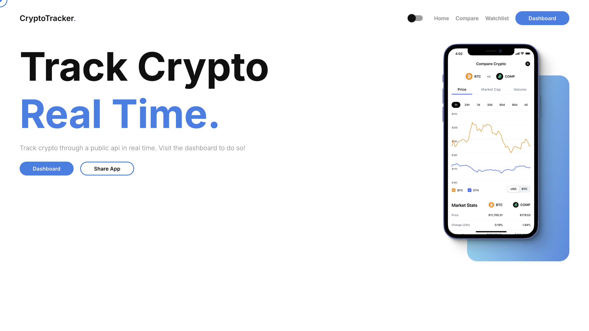
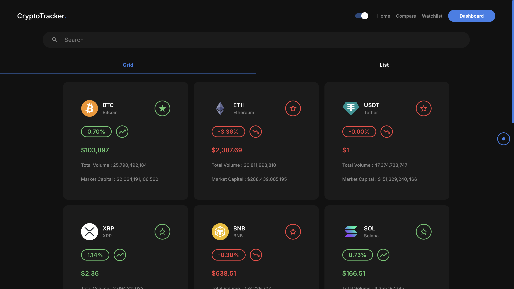
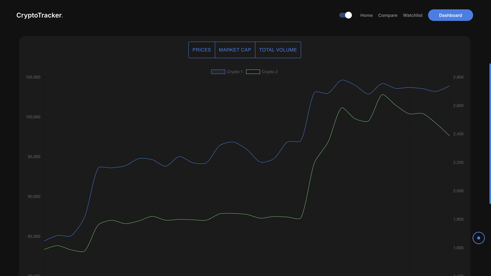
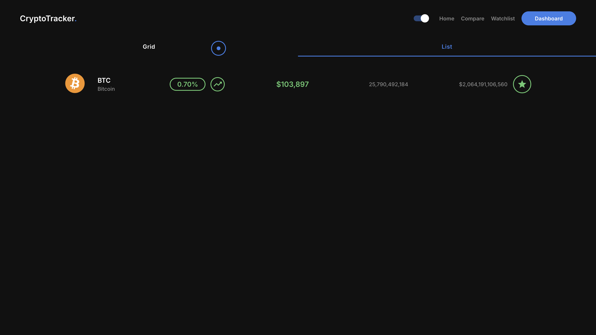

# CryptoTracker 🚀

A responsive web-based cryptocurrency tracking application built using **React + Vite**. This project fetches real-time data from a public API and provides users with:
- 🔎 **Live Dashboard** with price, volume, and market cap stats
- 📊 **Crypto Comparison** (BTC vs ETH or any others)
- 📌 **Watchlist** to track your favorite tokens
- 🌙 **Dark Mode Support**
- 📈 Interactive **Graphs & Charts** for analysis

---

## 🌐 Live Demo  
🔗 [View Live Site](https://crypto-tracker-app-ui.netlify.app)

---

## 📸 UI Screens Overview

Below are previews of key screens in the CryptoTracker app, demonstrating its core functionalities, UI layout, and interactive capabilities.

---

### 🏠 Home Page – Welcoming and Clear Interface



The home page provides a clean, minimalist landing experience. It briefly explains the app’s core functionality: real-time crypto tracking. The two CTAs – **Dashboard** and **Share App** – immediately guide users to the interactive part of the platform or encourage sharing.

---

### 📊 Dashboard – Market Overview in Grid View



This section offers a real-time **grid layout** showing market data for multiple cryptocurrencies. It includes percentage change, current price, volume, and market cap. The toggle at the top allows users to switch between **Grid** and **List** views. The dark mode enhances visual clarity.

---

### 🔍 Compare Cryptos – Visual Analysis of Two Coins


In this **Compare** page, users can select any two cryptocurrencies and analyze them over different timeframes (e.g., 30 days). Below the comparison cards, it provides **interactive graphs** for prices, market cap, and volume. Ideal for investors and analysts looking for trends.

---

### 📈 Graph View – Deep Dive Into Performance Metrics



This graph is a continuation of the comparison view. It visually tracks the selected metrics over time, helping users observe patterns in price and market movement. Users can easily toggle between **Prices**, **Market Cap**, and **Volume** metrics.

---

### ⭐ Watchlist – Your Tracked Favorites



The **Watchlist** feature allows users to save favorite cryptocurrencies. Data is displayed in a simplified format – clean and fast-loading. It supports both grid and list views and syncs with the star toggle available in dashboard and comparison views.

---

## ⚙️ Technologies Used
- **React** (Vite)
- **CoinGecko API**
- **CSS Modules & Tailwind**
- **React Router**
- **Netlify Deployment**

---

## 📁 Folder Structure

```
├── public/
├── src/
│   ├── components/
│   ├── pages/
│   └── assets/
├── netlify.toml
├── vite.config.js
├── package.json
```

---

## 🚀 Getting Started

```bash
git clone https://github.com/k3rthik/crypto_tracker.git
cd crypto_tracker
npm install
npm run dev
```

---

## 📦 Build

```bash
npm run build
```

---

## 🌍 Deployment

This app is deployed on **Netlify** using continuous deployment from GitHub.

---


